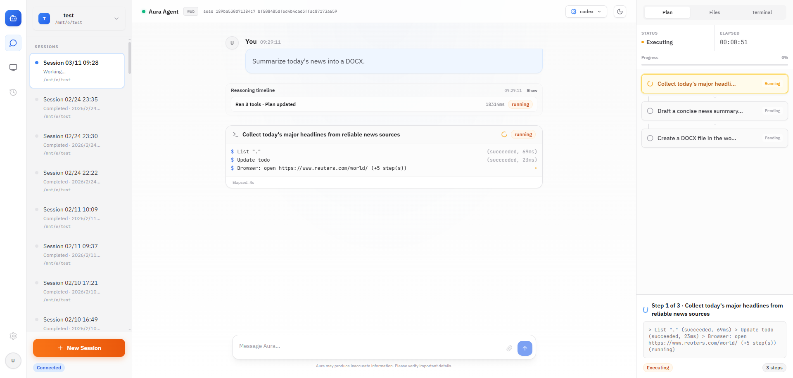
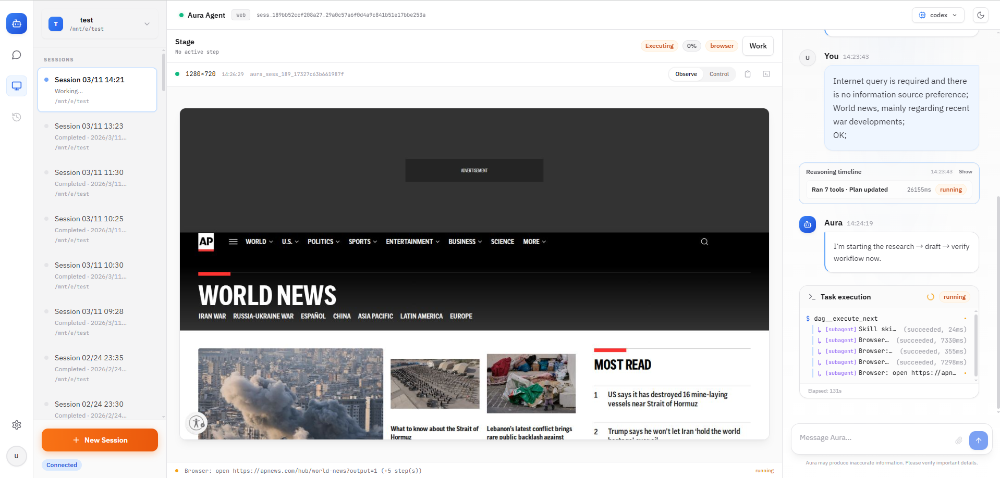

# AuraWork

面向办公场景的本地优先异步并行 Agent：澄清需求 → DAG 规划 → 带审批的执行。

English version: [`README.md`](./README.md)

AuraWork 把一次办公任务的运行拆成三层：

- **WorkSpec** — 澄清后的工作规格（目标、输入/输出、约束、范围、风险策略）
- **Plan** — 显式依赖的任务图（DAG），支持并行推进
- **Execute** — 带预演与审批的执行过程（产物、变更、决策可回放）

---

## 截图



<p>
  
</p>

---

## 项目状态

- 当前推荐使用 **CLI** 形态推进任务，这是最稳定的入口。
- **Web Workspace 仍在开发阶段**：前端交互与流程尚未打磨完成，预期有不稳定情况。
- 处于快速迭代期：数据结构与接口可能会有 breaking changes。

---

## 快速开始

### 环境要求

- Python **3.11+**
- Node.js **18+**（仅 Web 开发时需要）

### 安装

```bash
python -m venv .venv
source .venv/bin/activate
pip install -r requirements.txt
pip install -r web/backend/requirements.txt
```

### 初始化

```bash
python -m aura init .
```

编辑 `.aura/config/models.json`，填好你要用的模型 profile（`base_url` / `model` / `api_key` 等）。

### 运行

```bash
python -m aura chat
```

<details>
<summary>Web Workspace（开发中）</summary>

```bash
# 先安装前端依赖
cd web/frontend && npm install

# 同时启动后端与前端
./web-up.sh
```

当前版本不保证可用，仅用于开发与探索。

</details>

---

## 能力范围

### v0 已稳定

- **工作区文件整理与归档**：扫描、批量重命名、归档建目录、生成索引清单与整理报告、hash 去重
- **文档型交付物生成（vibe writing）**：从零散输入生成结构化文档初稿，支持反复迭代与版本对比
- **异步推进与可见进度**：有计划、有阶段、有产出；支持中途追加材料或约束

### 进行中

- **图片/截图 → 表格化产出**：多模态抽取为主，OCR 可选兜底
- **演示稿/报告落盘**（基础格式）
- **网页只读调研与汇总**：对比矩阵、证据留存与溯源

### v0 非目标

- 通用桌面 RPA（任意 GUI 自动化）
- 高复杂 Excel（大量公式/透视表/宏）一次成功自动生成

---

## 工作模型

### WorkSpec：先澄清，再执行

AuraWork 要求先把需求落成可执行的 `WorkSpec`，典型包含：

- 目标与交付物（expected outputs）
- 输入材料（files / URLs / notes）
- 约束（风格、模板、截止时间、禁止项）
- 资源范围（工作区根目录、文件类型白名单、域名白名单）
- 风险与审批策略（哪些动作需要审批）
- `intent_items`：澄清后可引用的行动意图条目，用于门控与审计对齐

这些字段不仅用于生成计划，也参与工具层门控：超出范围的路径/文件类型/域名访问会被拒绝或提升到更严格的审批。

### Planner / Worker 分工

| 角色 | 职责 |
|---|---|
| **Planner** | 生成/修改 DAG；决定是否采纳 Workers 的 Proposal |
| **Workers** | 执行单个节点；可以提出 Proposal，但不直接改图、不自行扩权 |

Worker 类型按办公场景固定职责：`FileOps`、`Doc`、`Sheet`、`Browser`（只读）、`Verifier`。

每个节点除描述要做什么，还带有执行约定（执行器类型、允许范围、期望产出），因此同一份计划既能被人阅读，也能直接驱动调度与回放。

### DAG 并行调度

调度器按依赖满足情况在并发上限内派发就绪节点。依赖边既用于语义依赖，也用于显式串行化以避免写冲突。

节点可返回补充步骤、验证建议或拆分建议，这些交给 Planner 决策后以增量方式更新计划，保持规划与执行的边界清晰。

### 自愈循环

对格式转换、公式引用等低级但高频的错误，Worker 可在节点内部执行有限次数的 **Action → Observe → Correct** 循环，避免把噪声升级为主流程的失败。

### 结构化中间层

Office/PDF 文件先转成结构化中间格式（Markdown/JSON，保留标题层级、表格边界、图片位置），在中间层做提取/修改/预览，再写回原格式交付。

---

## 审批与可控性

### 渐进授权

以工作区为权限边界，默认偏保守：低风险动作自动完成（只读分析、生成新文件），高风险动作（覆盖/移动/删除/执行命令）必须进入审批流。

### OperationPlan 预演

对批量变更类动作，先生成可读的"预演清单"（数量、类型聚合、规则摘要、diff 明细），再由用户决定执行或取消。

### 审批上浮与续跑

Workers 内部不做交互式审批：需要高风险工具时，停止在当前节点并返回结构化的审批请求（动作摘要、风险说明、diff/预览）。主流程统一呈现并把运行暂停在可恢复的位置。

一次审批记录可包含多个待执行的工具调用，减少重复确认。用户批准后，系统先执行被批准的调用，再把执行结果回注为续跑提示，不需要重新解释上下文。

也可接入只做判断的"审批代理"，基于 WorkSpec + 参数 + 预览做 `allow / deny / require_user` 决策，只有 `require_user` 才打断用户。

### 不可信输入治理

外部内容（网页/PDF/第三方文件）永远作为"数据"处理，而非"指令"：

- 仅用于抽取、摘要、对比、引用与证据留存
- 行动意图只来自 `WorkSpec.intent_items`，不来自外部文本
- 高副作用动作需能对齐到某条意图，并引用对应证据

---

## Skills

Skills 把一类办公交付固化为可复用单元：澄清问题集、DAG 模板、工具约束、验收方式、输出结构。

内置 Skills（`aura/builtin/skills/`）：

| Skill | 说明 |
|---|---|
| `aura-docx` | Word 文档读写与结构化处理 |
| `aura-pptx` | PowerPoint 读写 |
| `aura-xlsx` | Excel/表格读写 |
| `aura-pdf` | PDF 抽取与整理 |
| `agent-browser` | 网页只读调研与证据留存 |

---

## 后续计划

- [ ] 完成 Web Workspace：会话管理、事件/时间线回放、产物浏览、审批流 UI、DAG/计划视图
- [ ] 扩展办公场景能力：更多 SkillPack（整理归档/文档/表格/调研）与更稳定的中间层读写
- [ ] 更清晰的工作区初始化（带文件启动）、更细的资源范围约束与可见运行契约
- [ ] 在现有逻辑隔离基础上，引入更强隔离的执行选项（容器/VM 等）

---

## Third-party notices

部分内置 Skills 包含 Office Open XML schema 资源，许可声明位于：

```
aura/builtin/skills/*/ooxml/THIRD_PARTY_NOTICES.md
```

再分发时请保留这些声明。

---

## License

MIT. See [`LICENSE`](./LICENSE).
